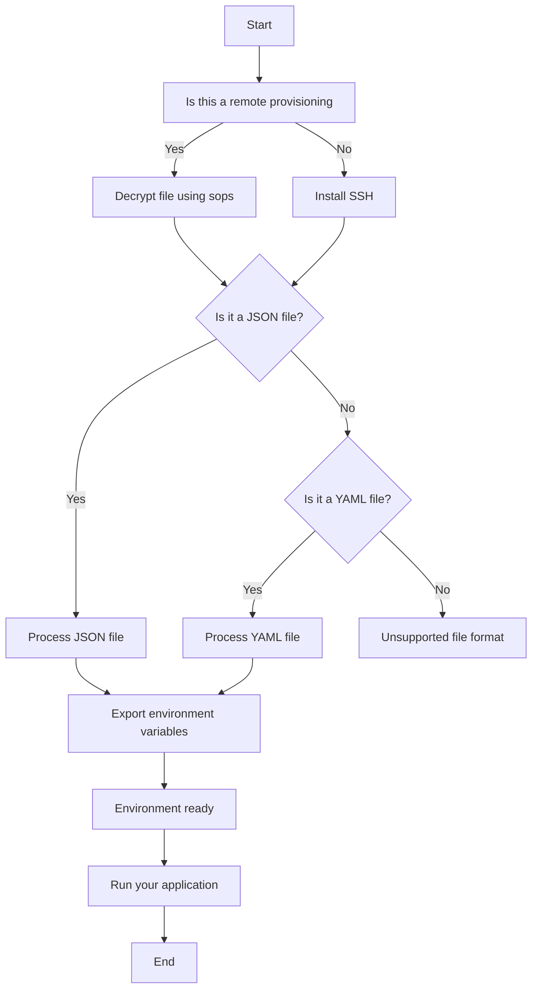

Steps to provision a new system:

- On the current machine (can be an ansible script)
    - Generate new ssh_key
    - Generate derived PGP key
    - armor both and add to ProvisionPackage.tar
    - upload provision package and add current machines ssh to 

- New Machine

- generate ssh id_rsa key for new machine
- Install Python
- --- Install ansible immediately ---
- ansible scripts
- 