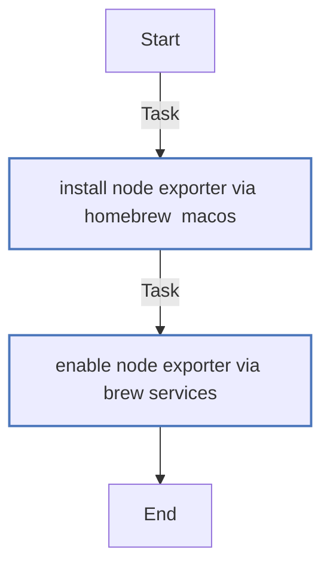
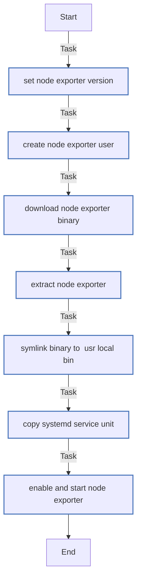
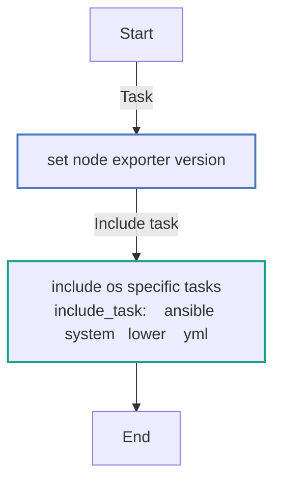

<!-- DOCSIBLE START -->

# 📃 Role overview

## node_exporter

Description: Not available.

| Field                | Value           |
|--------------------- |-----------------|
| Readme update        | 16/05/2025 |

### Tasks

#### File: tasks/darwin.yml

| Name | Module | Has Conditions |
| ---- | ------ | --------- |
| Install node_exporter via Homebrew (macOS) | homebrew | False |
| Enable node_exporter via brew services | ansible.builtin.command | False |

#### File: tasks/linux.yml

| Name | Module | Has Conditions |
| ---- | ------ | --------- |
| Set Node Exporter version | ansible.builtin.set_fact | False |
| Create node_exporter user | ansible.builtin.user | False |
| Download node_exporter binary | ansible.builtin.get_url | False |
| Extract node_exporter | ansible.builtin.unarchive | False |
| Symlink binary to /usr/local/bin | ansible.builtin.file | False |
| Copy systemd service unit | ansible.builtin.template | False |
| Enable and start node_exporter | ansible.builtin.systemd | False |

#### File: tasks/main.yml

| Name | Module | Has Conditions |
| ---- | ------ | --------- |
| Set Node Exporter version | set_fact | False |
| Include OS-specific tasks | include_tasks | False |

## Task Flow Graphs

### Graph for darwin.yml

### Graph for linux.yml

### Graph for main.yml

#### Dependencies

No dependencies specified.
<!-- DOCSIBLE END -->
